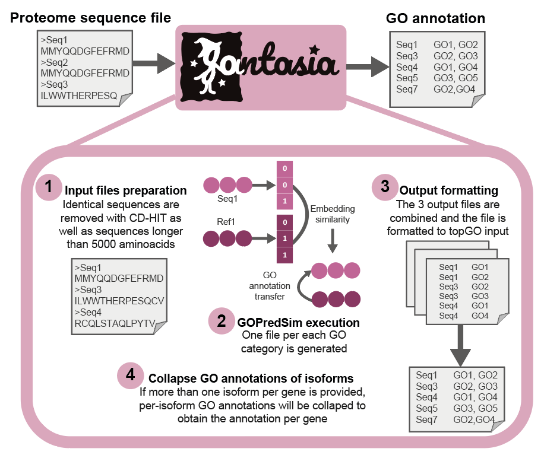

#  FANTASIA: Functional ANnoTAtion based on embedding space SImilArity

[](http://www.gnu.org/licenses/gpl.html)

FANTASIA (Functional ANnoTAtion based on embedding space SImilArity) is a pipeline for annotating GO terms in protein sequence files using GOPredSim ([to know more](https://github.com/Rostlab/goPredSim)) with the protein language model ProtT5. FANTASIA takes as input a proteome file (either the longest isoform or the full set of isoforms for all genes), removes identical sequences using CD-HIT (ref) and sequences longer than 5000 amino acids (due to a length constraint in the model), and executes GOPredSim-ProtT5 for all sequences. Then, it converts the standard GOPredSim output file to the input file format for topGO (ref) to facilitate its application in a wider biological workflow.

## Cite FANTASIA
Martínez-Redondo, G. I., Barrios, I., Vázquez-Valls, M., Rojas, A. M., & Fernández, R. (2024). Illuminating the functional landscape of the dark proteome across the Animal Tree of Life."

## How to use FANTASIA
<details open>
<summary><b>FANTASIA singularity image</b></summary>
</br>

  Download the singularity image from [here]().

  Once downloaded, you can execute it as follows (make sure that you have [singularity](https://docs.sylabs.io/guides/3.0/user-guide/installation.html) installed!):
  </br>
  
  ```
  Syntax: ./fantasia --infile protein.fasta [--outpath output_path] [--allisoforms gene_isoform_conversion.txt] [--keepintermediate]
  options:
  -i/--infile           Input protein fasta file.
  -h/--help             Print this Help.
  -o/--outpath          (Optional) Output directory. If not provided, input file directory will be used.
  -a/--allisoforms      (Optional) Tab-separated conversion file specifying the correspondance between gene and isoform IDs for obtaining a per-gene annotation using all isoforms.
  -p/--prefix           (Optional) Prefix to add to output folders and files (e.g. the species code). If not provided, input file name will be used.
  ```
  
</details>

</br>

<details>
<summary><b>Local installation and execution</b></summary>
</br>

  1.- Download the files and scripts from [here](http://gofile.me/5wDJy/GW4ew7RbW).
  
  2.- Open ```installation_guide_FANTASIA.sh``` (you can download it from this Github repository) and follow the instructions.
  
  3.- Execute FANTASIA (you can check the files and options required for each script by adding ```-h```).


</details>

</br>

<details open>
<summary><b>Galaxy implementation</b></summary>
</br>
Work in progress...
</details>
